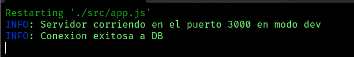

# PreEntrega 1

## Puertos utilizados:
- DEV - 3000
- PROD - 8080
- TEST - 7000

## Comando de instalación 
- npm install

## Comandos de ejecución 
Para poder iniciar la ejecución en algun entorno(dev,prod,test) ingresa uno de los siguientes comandos:

- Entorno DEV => npm run dev (ejecuta node --watch ./src/app.js) 
- Entorno PROD => npm run start (ejecuta node ./src/app.js --mode=prod) 
- Entorno TEST => npm run test (ejecuta node ./src/app.js --mode=test) 

Una vez ingresado el comando, en la consola apareceran los siguientes mensajes:

##  Registro dinamico de productos

Para realizar el registro de productos ingresar a la siguiente ruta(api/mocks/products/:products) y colocar el numero de productos a registrar.

- http://localhost:3000/api/mocks/products/5 => Este es un ejemplo del registro de 5 productos en el entorno de desarrollo(dev)

##  Registro dinamico de usuarios
Para realizar el registro de usuarios ingresar a la siguiente ruta(api/mocks/users/:users) y colocar el numero de usuarios a registrar:

- http://localhost:3000/api/mocks/users/5 => Este es un ejemplo del registro de 5 usuarios en el entorno de desarrollo(dev)

## Realizado con:
- [Javascript](https://developer.mozilla.org/es/docs/Web/JavaScript)
- [Node](https://nodejs.org/en/)
- [Express](https://expressjs.com/es/guide/routing.html)
- [Handlebars](https://handlebarsjs.com/)
- [MongoDB](https://www.mongodb.com/)
- [JWT](https://jwt.io/)
- [Cookie parser](https://www.npmjs.com/package/cookie-parser)
- [Passport](https://www.passportjs.org/)
